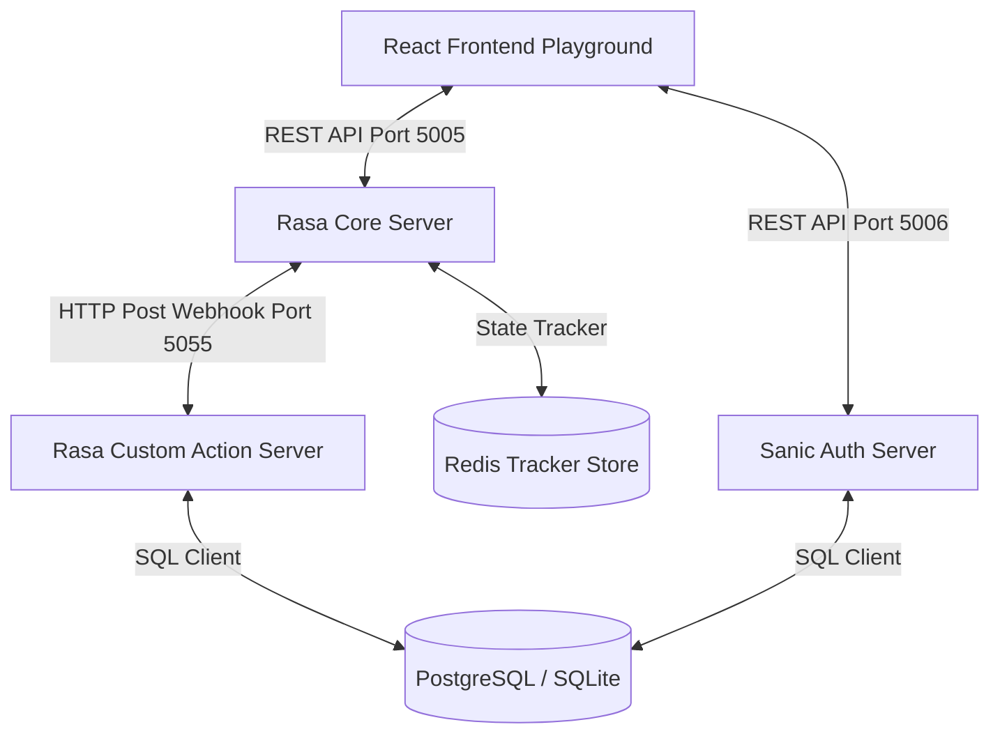

# TÀI LIỆU KỸ THUẬT HỆ THỐNG: UET CHATBOT PLATFORM

Chào mừng bạn đến với tài liệu kỹ thuật chi tiết của hệ thống **UET Chatbot Platform** - Nền tảng tư vấn tuyển sinh và hỗ trợ nộp hồ sơ xét tuyển nguyện vọng tự động dành cho Trường Đại học Công nghệ, Đại học Quốc gia Hà Nội (UET-VNU). 

Tài liệu này được biên soạn đầy đủ và chi tiết nhằm phục vụ công tác báo cáo môn học, phát triển và bảo trì hệ thống.

---

## MỤC LỤC
1. [Tổng Quan Hệ Thống](#1-tổng-quan-hệ-thống)
2. [Kiến Trúc & Công Nghệ Sử Dụng](#2-kiến-trúc--công-nghệ-sử-dụng)
3. [Cơ Sở Dữ Liệu (Database Schema)](#3-cơ-sở-dữ-liệu-database-schema)
4. [Rasa NLU Engine (Bộ Não Chatbot)](#4-rasa-nlu-engine-bộ-não-chatbot)
5. [Hệ Thống Custom Actions & Validations](#5-hệ-thống-custom-actions--validations)
6. [Cổng Đăng Nhập & Xác Minh (Sanic Auth Server)](#6-cổng-đăng-nhập--xác-minh-sanic-auth-server)
7. [Giao Diện Người Dùng (React Playground Frontend)](#7-giao-diện-người-dùng-react-playground-frontend)
8. [Hướng Dẫn Cài Đặt & Khởi Chạy](#8-hướng-dẫn-cài-đặt--khởi-chạy)
9. [Kịch Bản Thử Nghiệm Nghiệp Vụ (Testing Scenarios)](#9-kịch-bản-thử-nghiệm-nghiệp-vụ-testing-scenarios)

---

## 1. TỔNG QUAN HỆ THỐNG

**UET Chatbot Platform** giải quyết bài toán tự động hóa quy trình tư vấn và tiếp nhận hồ sơ xét tuyển đại học. Hệ thống hoạt động như một Trợ lý tuyển sinh ảo, có khả năng:
* **Tư vấn thông tin ngành học:** Trả cứu học phí, chỉ tiêu, điểm chuẩn năm trước của 20 ngành đào tạo tại UET (CN1 đến CN21).
* **Dẫn dắt điền thông tin (Form Filling):** Hướng dẫn thí sinh khai báo thông tin đăng ký nguyện vọng từng bước theo sơ đồ flowchart.
* **Hỗ trợ 4 phương thức xét tuyển chính:**
  1. **THPTQG:** Xét tuyển bằng điểm thi tốt nghiệp THPT Quốc gia.
  2. **HSA:** Xét tuyển bằng kết quả thi Đánh giá năng lực của ĐHQGHN.
  3. **IELTS:** Xét tuyển kết hợp chứng chỉ tiếng Anh quốc tế và điểm Toán.
  4. **TUYEN_THANG:** Xét tuyển diện thẳng (đạt giải học sinh giỏi quốc gia, quốc tế).
* **Quản lý trạng thái & xác minh minh chứng:** Lưu giữ hồ sơ vào cơ sở dữ liệu và cho phép thí sinh đăng nhập để kiểm tra trạng thái xác minh trực tuyến.

---

## 2. KIẾN TRÚC & CÔNG NGHỆ SỬ DỤNG

Hệ thống được thiết kế theo mô hình hướng dịch vụ (Service-Oriented Architecture - SOA) kết hợp cơ chế không đồng bộ, bao gồm 4 thành phần cốt lõi:



* **Frontend (React.js + Vite):** Giao diện Dashboard cao cấp, hiển thị hộp thoại chat, sơ đồ trực quan hóa bộ nhớ Slot của chatbot (Flowchart Visualizer) và bảng hiển thị dữ liệu thời gian thực (Mock Database View).
* **NLU & Conversational Dialog (Rasa Core/NLU):** Trực tiếp phân tích cú pháp ngôn ngữ tự nhiên, dự đoán Ý định (Intent), trích xuất Thực thể (Entity) và quản lý trạng thái hội thoại.
* **Custom Action Server (Python Rasa SDK):** Thực hiện các nghiệp vụ tính toán logic phức tạp, tra cứu và chèn dữ liệu trực tiếp vào database.
* **Authentication Server (Sanic Web Framework):** Dịch vụ backend chạy ngầm xử lý việc đăng ký, đăng nhập tài khoản học sinh và xác minh hồ sơ nhanh chóng thông qua kết nối cơ sở dữ liệu chung.
* **Storage Layer (Dual Database & Memory Store):**
  * **Redis (Port 6379):** Làm Tracker Store lưu trữ phiên hội thoại của Rasa.
  * **PostgreSQL / SQLite:** Lưu dữ liệu quan hệ (danh sách ngành, thông tin tài khoản người dùng, hồ sơ thí sinh đăng ký).

---

## 3. CƠ SỞ DỮ LIỆU (DATABASE SCHEMA)

Hệ thống hỗ trợ cơ chế tự động chuyển đổi dự phòng (Fallback): Ưu tiên kết nối cơ sở dữ liệu **PostgreSQL**, nếu lỗi sẽ tự động chuyển sang tệp **SQLite local** (`uet_admissions.db`).

### Sơ đồ quan hệ thực thể (ERD)

```
 [users] 1 -------- 0..* [candidates] 1 -------- 1 [admission_thptqg]
                        |             1 -------- 1 [admission_hsa]
                        |             1 -------- 1 [admission_ielts]
 [majors] 1 ----------- 0..*          1 -------- 1 [admission_direct]
```

### Chi tiết các bảng dữ liệu

#### 1. Bảng `users` (Tài khoản người dùng liên kết cổng Portal)
| Tên cột | Kiểu dữ liệu (PG / SQLite) | Thuộc tính | Mô tả |
| :--- | :--- | :--- | :--- |
| `id` | SERIAL / INTEGER | PRIMARY KEY | ID tự tăng định danh tài khoản |
| `email` | VARCHAR(100) / TEXT | UNIQUE, NOT NULL | Địa chỉ email đăng nhập |
| `password` | VARCHAR(255) / TEXT | NOT NULL | Mật khẩu tài khoản (mã hóa) |
| `created_at` | TIMESTAMP | DEFAULT CURRENT_TIMESTAMP | Thời gian đăng ký |

#### 2. Bảng `majors` (Danh mục ngành học của UET)
| Tên cột | Kiểu dữ liệu | Thuộc tính | Mô tả |
| :--- | :--- | :--- | :--- |
| `major_code` | VARCHAR(10) / TEXT | PRIMARY KEY | Mã ngành của trường (VD: CN1, CN8) |
| `major_name` | VARCHAR(100) / TEXT | NOT NULL | Tên ngành học đầy đủ |
| `tuition_fee` | DECIMAL / REAL | | Học phí dự kiến (triệu VNĐ/năm) |
| `benchmark_2025` | DECIMAL / REAL | | Điểm chuẩn năm 2025 |
| `quota` | INT / INTEGER | | Chỉ tiêu tuyển sinh |
| `description` | TEXT | | Mô tả chi tiết về chương trình đào tạo |

#### 3. Bảng `candidates` (Thông tin hồ sơ gốc của thí sinh)
| Tên cột | Kiểu dữ liệu | Thuộc tính | Mô tả |
| :--- | :--- | :--- | :--- |
| `id` | SERIAL / INTEGER | PRIMARY KEY | Mã hồ sơ tự tăng |
| `user_id` | INT / INTEGER | FOREIGN KEY REFERENCES `users(id)` | ID tài khoản liên kết (nếu có) |
| `fullname` | VARCHAR(100) / TEXT | NOT NULL | Họ và tên đầy đủ |
| `phone_number` | VARCHAR(15) / TEXT | NOT NULL | Số điện thoại liên hệ |
| `chosen_major_code`| VARCHAR(10) / TEXT | FOREIGN KEY REFERENCES `majors(major_code)` | Mã ngành đăng ký xét tuyển |
| `admission_method` | VARCHAR(20) / TEXT | NOT NULL | Phương thức xét tuyển (THPTQG, HSA...) |
| `is_verified` | INT / INTEGER | DEFAULT 0 | 0: Chưa xác minh, 1: Đã duyệt minh chứng |
| `created_at` | TIMESTAMP | DEFAULT CURRENT_TIMESTAMP | Thời điểm nộp hồ sơ |

#### 4. Bảng phụ `admission_thptqg` (Chi tiết xét tuyển THPT)
| Tên cột | Kiểu dữ liệu | Thuộc tính | Mô tả |
| :--- | :--- | :--- | :--- |
| `candidate_id` | INT / INTEGER | PRIMARY KEY, FK REFERENCES `candidates(id)` | Liên kết mã hồ sơ gốc |
| `block_name` | VARCHAR(5) / TEXT | NOT NULL | Khối thi xét tuyển (A00, A01, D01...) |
| `total_score` | DECIMAL / REAL | NOT NULL | Tổng điểm tổ hợp 3 môn thi |
| `evidence_url` | TEXT | NOT NULL | Đường dẫn minh chứng (ảnh học bạ/điểm thi) |

#### 5. Bảng phụ `admission_hsa` (Chi tiết xét tuyển ĐGNL)
| Tên cột | Kiểu dữ liệu | Thuộc tính | Mô tả |
| :--- | :--- | :--- | :--- |
| `candidate_id` | INT / INTEGER | PRIMARY KEY, FK REFERENCES `candidates(id)` | Liên kết mã hồ sơ gốc |
| `hsa_id` | VARCHAR(20) / TEXT | NOT NULL | Số báo danh kỳ thi HSA |
| `hsa_score` | INT / INTEGER | NOT NULL | Tổng điểm thi (thang điểm 150) |
| `evidence_url` | TEXT | NOT NULL | Đường dẫn minh chứng |

#### 6. Bảng phụ `admission_ielts` (Chi tiết xét tuyển kết hợp)
| Tên cột | Kiểu dữ liệu | Thuộc tính | Mô tả |
| :--- | :--- | :--- | :--- |
| `candidate_id` | INT / INTEGER | PRIMARY KEY, FK REFERENCES `candidates(id)` | Liên kết mã hồ sơ gốc |
| `ielts_score` | DECIMAL / REAL | NOT NULL | Điểm thi chứng chỉ IELTS (thang 9.0) |
| `math_score` | DECIMAL / REAL | NOT NULL | Điểm học bạ hoặc thi môn Toán |
| `evidence_url` | TEXT | NOT NULL | Đường dẫn minh chứng |

#### 7. Bảng phụ `admission_direct` (Chi tiết tuyển thẳng)
| Tên cột | Kiểu dữ liệu | Thuộc tính | Mô tả |
| :--- | :--- | :--- | :--- |
| `candidate_id` | INT / INTEGER | PRIMARY KEY, FK REFERENCES `candidates(id)` | Liên kết mã hồ sơ gốc |
| `award_name` | VARCHAR(255) / TEXT | NOT NULL | Nội dung giải thưởng HSG đạt được |
| `evidence_url` | TEXT | NOT NULL | Đường dẫn minh chứng |

---

## 4. RASA NLU ENGINE (BỘ NÃO CHATBOT)

Rasa chịu trách nhiệm xử lý ngôn ngữ tự nhiên từ tin nhắn thô của thí sinh.

### 4.1. Intent & Entity chính
* `hoi_thong_tin_nganh`: Người dùng hỏi thông tin ngành học chung (VD: "ngành khoa học máy tính học gì").
* `hoi_hoc_phi`: Hỏi về học phí (VD: "học phí ngành cn1 là bao nhiêu").
* `hoi_diem_chuan`: Hỏi về điểm chuẩn (VD: "ngành cn8 lấy bao nhiêu điểm").
* `dang_ky_nguyen_vong`: Bắt đầu quy trình nộp hồ sơ nguyện vọng trực tuyến.
* `huy_bo`: Yêu cầu hủy bỏ luồng điền form đang chạy.
* `xac_nhan`: Đồng ý/xác nhận thông tin.
* **Entities:**
  * `major` / `nganh_hoc`: Nhận diện tên ngành học hoặc mã ngành (VD: "Khoa học máy tính", "CN8").
  * `thptqg_block`: Tổ hợp môn thi (VD: "A00", "A01", "D01").

### 4.2. Quản lý trạng thái bộ nhớ (Slots)
Rasa duy trì trạng thái cuộc trò chuyện thông qua danh sách các biến Slot được khai báo trong `domain.yml`:
* Thông tin chung: `fullname`, `phone_number`, `chosen_major`, `evidence_url`.
* Theo phương thức: `thptqg_block`, `thptqg_score`, `hsa_id`, `hsa_score`, `ielts_score`, `math_score`, `award_name`.
* Quản lý luồng: `confirm_registration`, `last_queried_major` (dùng để ghi nhớ ngành thí sinh vừa hỏi ở lượt trước làm context).

---

## 5. HỆ THỐNG CUSTOM ACTIONS & VALIDATIONS

Để đảm bảo tính đúng đắn của dữ liệu trước khi chèn vào database, hệ thống sử dụng cơ chế Form Validation chạy tại Action Server.

### 5.1. Quy tắc kiểm tra tính hợp lệ dữ liệu (Validation Rules)

Quy trình xác minh dữ liệu đầu vào được cài đặt trong `validate_forms.py` bao gồm:

* **Họ và tên (`fullname`):**
  * Không được trống.
  * Phải có ít nhất 2 từ trở lên (đảm bảo đủ họ và tên).
  * Không chứa số hoặc ký tự đặc biệt.
* **Số điện thoại (`phone_number`):**
  * Định dạng số điện thoại Việt Nam gồm đúng 10 chữ số.
  * Bắt đầu bằng chữ số `0`.
* **Ngành đăng ký (`chosen_major`):**
  * Phải khớp với danh sách mã ngành hợp lệ (CN1 đến CN21, trừ CN16) hoặc tên ngành tương ứng có trong bảng CSDL.
* **Đường dẫn minh chứng (`evidence_url`):**
  * Phải có định dạng liên kết URL hợp lệ bắt đầu bằng `http://` hoặc `https://`.
* **Tổ hợp môn xét tuyển (`thptqg_block`):**
  * Phải thuộc danh sách các khối xét tuyển được trường chấp nhận: `A00`, `A01`, `A02`, `D01`, `D07`, `X06`.
* **Điểm thi THPTQG (`thptqg_score`):**
  * Giá trị nằm trong khoảng từ `0.0` đến `30.0`.
* **Mã số báo danh HSA (`hsa_id`):**
  * Bắt đầu bằng tiền tố `HSA-` và theo sau bởi tối thiểu 5 ký tự chữ hoặc số (Ví dụ: `HSA-12345`).
* **Điểm thi HSA (`hsa_score`):**
  * Chấp nhận số nguyên hoặc số thực trong khoảng từ `0.0` đến `150.0`.
* **Điểm thi IELTS (`ielts_score`):**
  * Điểm số từ `0.0` đến `9.0` (bước chia điểm lẻ `0.5`). Ngưỡng tối thiểu được phép đăng ký xét tuyển là từ `5.5` trở lên.
* **Điểm môn Toán học bạ kết hợp (`math_score`):**
  * Thang điểm từ `0.0` đến `10.0`.
* **Tên giải thưởng tuyển thẳng (`award_name`):**
  * Chuỗi văn bản dài tối thiểu 5 ký tự và bắt buộc phải chứa các từ khóa liên quan như: `"giải"`, `"olympic"`, `"huy chương"`, `"hsg"`.

### 5.2. Các Custom Actions xử lý nghiệp vụ

Cài đặt trong `query_actions.py` và `submit_actions.py`:

* **`action_query_major_info`:** Thực hiện truy vấn thông tin chung về ngành học dựa trên thực thể được trích xuất. Nếu người dùng hỏi chung chung không kèm tên ngành, hệ thống sẽ kiểm tra slot `last_queried_major` (ngành vừa hỏi ở lượt trước) để làm ngữ cảnh trả lời tiếp tục.
* **`action_query_tuition_by_major` / `action_query_benchmark_by_major`:** Tra cứu học phí hoặc điểm chuẩn tương ứng của ngành học được yêu cầu từ CSDL.
* **`action_submit_<method>_form`:** Khi toàn bộ slot của phương thức tương ứng được điền đầy đủ và người dùng xác nhận nộp, action này sẽ tiến hành ghi hồ sơ mới vào bảng `candidates` và bảng phụ tương ứng, tạo mã hồ sơ dạng `#UET-<id>` và reset lại bộ nhớ slot để chuẩn bị cho hội thoại mới.
* **`action_cancel_flow`:** Xử lý việc hủy bỏ luồng điền form hiện tại, xóa sạch bộ nhớ tạm của form và đưa chatbot về trạng thái tự do.

---

## 6. CỔNG ĐĂNG NHẬP & XÁC MINH (SANIC AUTH SERVER)

Bên cạnh dịch vụ Rasa, file `auth_server.py` khởi chạy một máy chủ Sanic độc lập tại port **5006** làm nhiệm vụ kết nối trực tiếp đến CSDL nhằm phục vụ việc kiểm tra và cập nhật thông tin hồ sơ cho học sinh.

### Các API Endpoint của Auth Server:

#### 1. POST `/api/register`
* **Mục đích:** Tạo tài khoản học sinh mới.
* **Request Body:**
  ```json
  {
    "email": "student@example.com",
    "fullname": "Nguyễn Văn A",
    "password": "mypassword123"
  }
  ```
* **Response (Thành công):**
  ```json
  {
    "status": "success",
    "user": {
      "id": 1,
      "email": "student@example.com",
      "fullname": "Nguyễn Văn A"
    }
  }
  ```

#### 2. POST `/api/login`
* **Mục đích:** Xác thực tài khoản học sinh và tải danh sách hồ sơ đăng ký nguyện vọng liên kết với email tương ứng.
* **Request Body:**
  ```json
  {
    "email": "student@example.com",
    "password": "mypassword123"
  }
  ```
* **Response (Thành công):**
  ```json
  {
    "status": "success",
    "user": { "id": 1, "email": "student@example.com", "fullname": "Nguyễn Văn A" },
    "aspirations": [
      {
        "id": 12,
        "chosen_major": "Khoa học máy tính (CN1)",
        "admission_method": "THPTQG",
        "is_verified": true,
        "details": { "evidence_url": "https://link-to-evidence.com" }
      }
    ]
  }
  ```

#### 3. POST `/api/verify`
* **Mục đích:** Cho phép duyệt trực tuyến trạng thái của hồ sơ (đổi trạng thái `is_verified` thành `1` trong cơ sở dữ liệu).
* **Request Body:**
  ```json
  {
    "candidate_id": "UET-12"
  }
  ```
* **Response:** `{"status": "success"}`

---

## 7. GIAO DIỆN NGƯỜI DÙNG (REACT PLAYGROUND FRONTEND)

Frontend được phát triển bằng React + Vite, tối ưu trải nghiệm tương tác với các tính năng:
* **Hộp thoại Chat thông minh:** Gửi câu hỏi tự do hoặc phản hồi nhanh bằng các nút bấm gợi ý (Quick reply buttons) nhận về từ Rasa Core.
* **Flowchart Visualizer (Sơ đồ Tiến trình):** Thành phần đồ họa trực quan hóa luồng điền form hiện tại. Khi người dùng khai báo thông tin đến đâu, nút tiến trình tương ứng trên giao diện sẽ sáng xanh lên và hiển thị trường thông tin kế tiếp cần thu thập.
* **Mock Database View:** Hiển thị trực quan dữ liệu hồ sơ vừa được ghi vào database của hệ thống sau khi thí sinh hoàn tất hội thoại.

---

## 8. HƯỚNG DẪN CÀI ĐẶT & KHỞI CHẠY

### 8.1. Yêu cầu hệ thống
* Cài đặt Python 3.10+
* Docker & Docker Compose (cho PostgreSQL, Redis, MongoDB)
* Node.js v18+

### 8.2. Các bước cài đặt và khởi chạy chi tiết

#### Bước 1: Khởi động hệ thống cơ sở dữ liệu dự phòng (Docker)
Di chuyển đến thư mục chứa cấu hình Docker compose và khởi chạy các container:
```bash
cd nlu-engine
docker compose up -d
```
Lệnh này sẽ khởi động cơ sở dữ liệu Redis và PostgreSQL làm hệ lưu trữ chính.

#### Bước 2: Thiết lập môi trường ảo Python & Cài đặt thư viện
```bash
cd nlu-engine
python3 -m venv venv
source venv/bin/activate
pip install -r requirements.txt
```

#### Bước 3: Huấn luyện và chạy Rasa Server
```bash
# Huấn luyện mô hình NLU
rasa train

# Chạy Rasa Core Server (lắng nghe tại cổng 5005)
rasa run --enable-api --cors "*"
```

#### Bước 4: Chạy Rasa Action Server (Cổng 5055)
Mở terminal mới, kích hoạt môi trường ảo `venv` và chạy:
```bash
cd nlu-engine
source venv/bin/activate
rasa run actions
```

#### Bước 5: Chạy Sanic Auth Server (Cổng 5006)
Mở terminal mới, kích hoạt môi trường ảo và khởi động server xác thực:
```bash
cd nlu-engine
source venv/bin/activate
python auth_server.py
```

#### Bước 6: Khởi chạy Giao diện Frontend
Mở một terminal khác, truy cập thư mục frontend, cài đặt npm và chạy dev server:
```bash
cd frontend
npm install
npm run dev
```
Truy cập ứng dụng tại địa chỉ: `http://localhost:5173`.

---

## 9. KỊCH BẢN THỬ NGHIỆM NGHIỆP VỤ (TESTING SCENARIOS)

Để kiểm chứng tính ổn định của hệ thống, nhà phát triển có thể thử nghiệm qua các kịch bản sau:

### Kịch bản 1: Đăng ký nguyện vọng phương thức HSA thành công (Happy Path)
1. **User:** "Mình muốn đăng ký xét tuyển."
2. **Bot:** "Vui lòng chọn 1 trong 4 phương thức xét tuyển..." (Hiển thị các nút bấm).
3. **User:** Chọn nút *"Xét tuyển HSA (ĐGNL) ⚡"*.
4. **Bot:** "Hệ thống đã nhận phương thức xét tuyển: HSA. Vui lòng cung cấp Họ và tên đầy đủ của thí sinh:"
5. **User:** "Nguyễn Văn Nam"
6. **Bot:** "Vui lòng cung cấp Số điện thoại liên hệ chính thức:"
7. **User:** "0987654321"
8. **Bot:** "Bạn muốn đăng ký nguyện vọng vào ngành nào?..." (Hiển thị nút chọn ngành).
9. **User:** Chọn *"Khoa học máy tính (CN1)"*.
10. **Bot:** "Nhập số báo danh kì thi HSA của bạn (Ví dụ: HSA-12345):"
11. **User:** "HSA-88990"
12. **Bot:** "Tổng điểm thi HSA (ĐGNL) của bạn là bao nhiêu (Thang điểm 150)?"
13. **User:** "123.0" *(Thử nghiệm định dạng float)*
14. **Bot:** Xác nhận lưu thành công hồ sơ vào Mock Database với điểm số được lưu là số nguyên `123`.

### Kịch bản 2: Hỏi xen ngang trong khi đang điền hồ sơ (Unhappy Path)
1. Hệ thống đang ở bước yêu cầu nhập Số điện thoại của phương thức xét tuyển THPTQG.
2. **User:** "Học phí ngành CNTT (CN4) bao nhiêu tiền vậy?"
3. **Bot:** Nhận dạng người dùng đang hỏi xen ngang. Trả lời: *"Học phí dự kiến ngành Công nghệ thông tin (CN4) là 40 triệu VNĐ/năm... Quay lại hồ sơ của bạn, xin vui lòng cung cấp tiếp số điện thoại liên hệ chính thức."*
4. **User:** "0912233445"
5. **Bot:** Ghi nhận số điện thoại hợp lệ và tiếp tục chuyển sang hỏi tên ngành đăng ký theo luồng.
